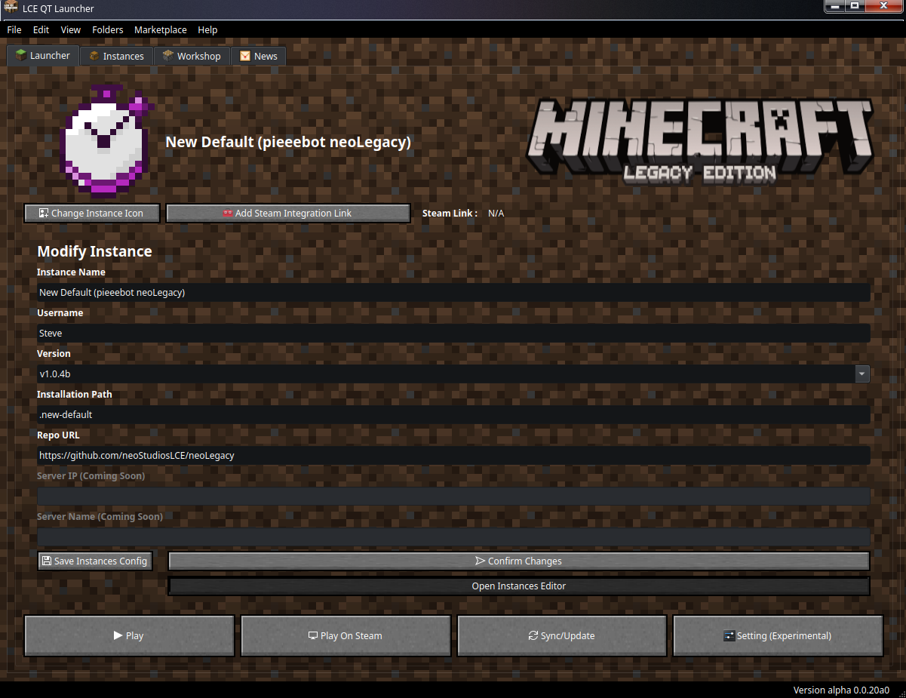

# LCE QT Launcher

[French Version](lisezmoi.md)

> [!WARNING]
> This launcher is work in progress and its feature could be changes or remove at any time.
> PR are more than welcome to fix or add features. Just be compliant with the [GPLv3 license](license.md) and the [Code of Respect](code-of-conduct.md)

## About

This is a custom Minecraft LCE Launcher written in Python and Qt with Freedom and with GNU/Linux support in mind.

## Features

- Command Line interface (CLI)
- Qt 6 GUI (Native like Interface)
- Written in Python (No Electron or Rust)
- Customisable
- Free Software (GPLv3)
- Multiple Instances (Work in progress)
- localisations (Work in progress)
<!-- Coming laters: 
- Launcher Plugins
- Skin support
- Modding Support -->
- Multiples Defaults Instances : MCLE and Legacy Evolved
- in-app news
- Minecraft Theme pre-configured

## Long Term Goal

- Accessibility
- GNU/Linux compatibility
- Windows support
- Experimental FreeBSD support
- Focus on being the main hub for Minecraft LCE on GNU/Linux

## How to run

### VSCode

1. Create a Python Virtual Env via a tool like UV
2. Set VSCode to that Python Virtual Env
3. Run "Pyside : Sync Virtual Env and Launch"
4. Run the app via Vscode debug mode or directly the [`src/main.py`](src/main.py) file.

### Others

Guide coming laters

## How to build

Coming in the next stable release when the program will be more stable

## Nigthly Build

> [!NOTE]
> This automatic nighly build is currently not-stable and is very experimental and in active developpement
> This branch is not stable and changes are made almost daily so this branch can sometimes break. Also, MacOS is not avaiable in the Nigthly Build due to Apple restriction and that I do now own a mac.

In this [GitHub Release](https://github.com/xgui4/LCE-Qt-Launcher/releases/tag/nightly) page you will found Nighly Build which are made automatically via GitHub Action when change are made in the `nighly` branch

## Software Requirement

- [Python 3.11 (For FreeBSD) to Python 3.12 (GNU/Linux, Windows and MacOS)](https://www.python.org)
  - with a virtual env with the required library install (specified in the readme and [`pyproject.toml`](pyproject.toml))
- [PySide6](https://pypi.org/project/PySide6/)
- [Monocraft Font](https://github.com/IdreesInc/Monocraft) installed
- For UNIX like system
  - A display server or compositor (Except on MacOS where it use its own proprietary one)
  - Bash (normally pre-installed on Linux but often demand installation in *BSD and MacOS)

## Python Library and Tools Used

- PySide 6
- requests
- rich
- hatch
- uv

## Compatible Operating System

### Golden Support

- Windows 10 and later
- GNU/Linux

### Experimental Support

- FreeBSD

### Unsupported OS

- Other *BSD system, as Minecraft LCE is not supported on those and Wine is not available.
- Minecraft LCE on Android is currently quite laggy and buggy
- macOS: LCE Qt Launcher does not officially support MacOS and is not tested during PRs, but POISX compatibility should allow its use.

## Thank to

- [Prism Launcher](https://github.com/PrismLauncher/PrismLauncher) for certain UI elements and ui files
- [MCLCE/MinecraftConsoles](https://github.com/MCLCE/MinecraftConsoles) for the port of the game for PC
- [pieeebot/neoLegacy](https://github.com/pieeebot/neoLegacy) for backporting updates for the PC port

## Code of Respect

- [English](code-of-conduct.md)
- [French](CODE-DE-CONDUITE.md)

## License

[GPLV3](license.md)
